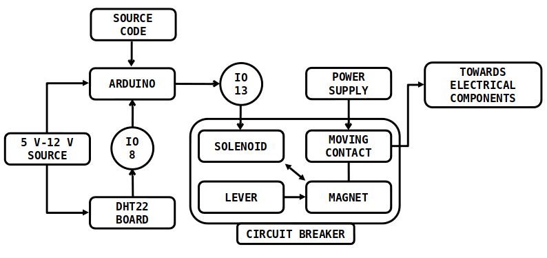
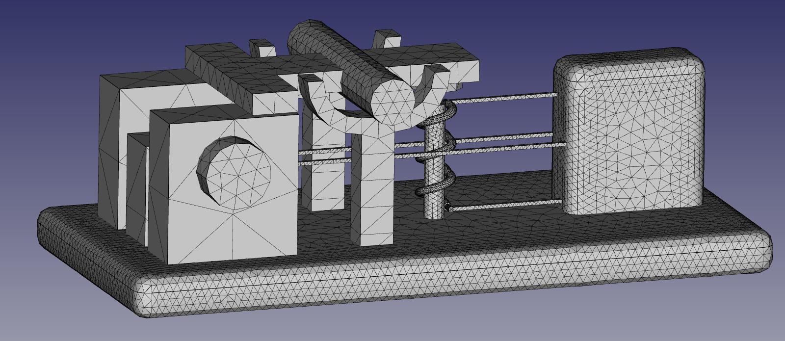
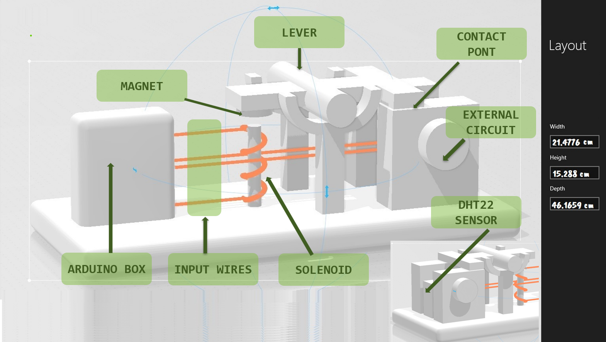
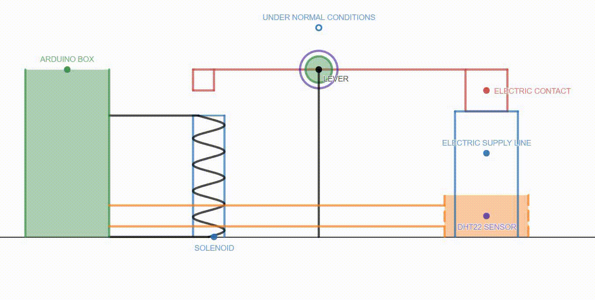

# DIY-Project
## Safer Electrical Components
#### Have a look at the files [MODEL.FCStd](MODEL.FCStd) and [meshed_model.stl](meshed_model.stl) containing the actual 3-D models.
#### The driver code to Arduino is written in the file [driver_code.cpp](driver_code.cpp)
### This is a DIY project modelling a component aimed at making electrical contacts safer at locations where temperature and humidity conditions are adverse.
The idea is to use a DHT-22 temperature and humidity sensor that gives signal to the Arduino whenever the temperature or humidity exceeds the specified cut-off (depending upon the exact conditions and infrastructure). The Arduino in-turn gives signal to a solenoid that powers-up a magnet pulling down a lever lifting up a connecting plate that disconnects the circuit and prevents further flow of current.

<i><h3>
The flow diagram
    </h3></i> 

  

<i><h3>
The Mesh done on FreeCAD
    </h3></i> 

   

<i><h3>
The CAD Model
    </h3></i> 

<i><h3>
A simple schematic simulation
    </h3></i> 

